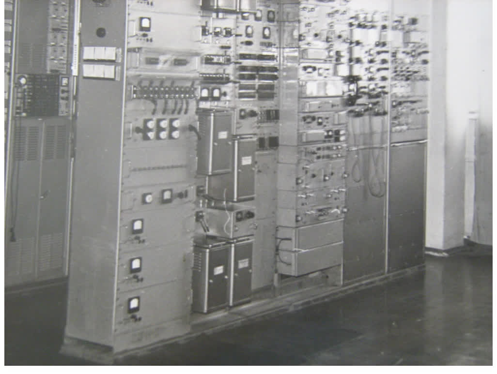

# Зарождение электросвязи (телеграф, телефон, радио) в мире, в России, на Дону

## Электросвязь в мире

Слово «Телеграф» происходит от двух древнегреческих слов — tele (далеко) и grapho (пишу). В современном значении это просто средство передачи сигналов по проводам, радио или другим каналам связи. Хотя первые телеграфы были беспроводными, — ещё задолго до того, как научиться переписываться и передавать какую-либо информацию на большие расстояния, люди научились перестукиваться, перемигиваться, разводить костры и стучать в барабаны, — всё это тоже можно считать телеграфами.

Электрические телеграфы стали возможны лишь тогда, когда люди стали более плотно изучать природу электричества, — примерно в XVIII веке. Так, 21 октября 1832 года Павел Львович Шиллинг продемонстрировал первый в мире электромагнитный телеграф. Пятикомнатная квартира оказалась мала для демонстрации, и ученый нанял весь этаж. Передатчик был установлен в одном конце здания, где собрались приглашенные, а приемник — в другом, в кабинете Шиллинга. Расстояние между аппаратами составило свыше 100 м.

В области Войска Донского первые телеграфы были открыты в 60-х годах XIX века. Телеграфы были расположены по реке Дон. В 1859 году в Ростове-на-Дону открывается телеграфная контора, а в 1866 году наказной атаман А. Потапов писал князю Трубецкому: «Государственный телеграф, дойдя до Воронежа, сворачивает на Курск и Тамбов и выходит к Новочеркасску через Харьков и Саратов, оставляя без телеграфного сообщения большую часть Войска Донского».

С 80-х годов XIX века начинается массовое развитие телеграфных станций. Они открываются в станицах Вешенской, Урюпинской, Милютинской,Чирковской, Александровской и Аксайской, а также в селах Маргаритовке, Голодаевке, Александровск–Грушевке (ныне город Шахты).
Развитие сети телеграфных станций поставило вопрос о соединении городов с другими населенными пунктами России. 

В 1904 году Ростов связывается с Екатеринодаром. В 1906 году — с Одессой, а в 1908 году — с Пятигорском. В 1904 году открывается прямая линия Ростов — Москва — Петербург. В 1908 году — линия Ростов — Харьков — Москва и Таганрог — Мариуполь.
Несмотря на свое развитие, почта и телеграф не могли удовлетворить потребности развивающейся промышленности и торговли. Требовалась более быстрая и надежная связь.
Таким средством связи впоследствии явился телефон.

В 1860 году естествоиспытатель Антонио Меуччи опубликовал статью в итальянской газете Нью-Йорка, в которой рассказал о своем изобретении, способном передавать звуки по электрическим проводам. Свой аппарат Меуччи назвал Teletrofono. В 1871 году он решил запатентовать Teletrofono, однако из-за финансовых проблем сделать этого так и не смог.

Создателем телефона всё же считается Александр Грехем Белл, а годом изобретения телефона — 1876. Именно тогда шотландский ученый представил на Всемирной выставке свой первый аппарат, а также подал заявку на получение патента на изобретение. 

Просвещенные граждане Российской империи с конца 70-х годов XIX века обращались в Кабинет Министров с предложениями организовать телефонные коммуникации в крупнейших городах империи. 

Частным образом телефоны уже работали в стране, соединяя дома и конторы видных промышленников, а также резиденции монарших особ.

Первый телефонный междугородный звонок в России был произведен в 1879 году из Петербурга на железнодорожную станцию Малая Вишера (в 150 верстах от столицы). Это был частный звонок. 
Приобщение россиян в массовом порядке к телефонной связи началось с Высочайшего утверждения «Об устройстве городских телефонов», поступившего из Кабинета Министров 25 сентября 1881 года. 

Телефонную связь предоставляли частные компании. 

Первый телефон Области Войска Донского зазвонил в 1886 году в городе Ростове-на-Дону (запущена телефонная станция и коммутатор).

Протокол исторического заседания Русского физико-химического общества 25 апреля 1895 года, на котором русский физик и электротехник, изобретатель, статский советник, почётный инженер-электрик Александр Степанович Попов продемонстрировал свое изобретение.

В 1910 году в Ростове заработал первый телефон-автомат.

Газета «Приазовский край» тогда писала: «На днях Городскою Управою в городском саду установлен первый телефон-автомат для общего пользования. Плата за разговор — 10 копеек».
Через год в городе появилось ещё 4 автомата, а к 1916 году их было уже 10: в городском саду (ныне парк им. М. Горького), на почте, на вокзале, на углу улицы Большой Садовой и Богатяновского переулка.
К 1917 году число абонентов городской телефонной сети превысило 4 тысячи.

К тому времени Ростов был одним из самых «телефонизированных» городов России.

К началу 1927 года в городе Ростове-на-Дону было 3526 абонентов телефонной сети. Естественно, что телефонисткам трудно было справиться с таким объемом телефонных сообщений.
Поэтому 9 февраля 1927 года на заседании малого Президиума Северо-Кавказского Крайисполкома было принять решение о постройке в Ростове-на-Дону автоматической телефонной станции (АТС).
Строительство и монтаж оборудования продолжались два года.
3 августа 1929 года автоматическая станция на 6000 номеров вступила в эксплуатацию. Она просуществовала до 1941 года.
Это была первая автоматическая телефонная станция в России. 

## Появление электросвязи в Морозовске

1907 год
Дело Управления Ростовского Почтово-Телеграфного Округа «Об открытии телеграфа при Морозовском почтовом отделении Донской области, находящимся при одноименной станции Юго-Восточных железных дорог».

Местное купечество, желая ускорить работы по строительству телеграфа при станции Морозовская, не остается в стороне. Купцы пишут прошение в Управление Ростовского Почтово-Телеграфного Округа о своей потребности в телеграфе. В документе хорошо читаются имена и фамилии: Александр Татарков, Федор Афанасьев, войсковой старшина Чекалов, Сиволобов, Худолясов, Арутюнов А.Н., Михаилиби И.М.

Представлена первая телеграмма, отправленная из почтово-телеграфной конторы при станции Морозовская, располагавшейся на тот момент по адресу: ул. Жукова, 194.
Дата отправления — 3 декабря 1907года. 
3 декабря 1907 года можно по праву считать Днем рождения телеграфа, а значит — связи как таковой в нашем городе.

В архиве также сохранилось прошение жителей, но на этот раз о необходимости телефона. Датируется оно 1910 годом.

1911 год
Управление Почтово-Телеграфного Округа открывает дело «О строительстве Правительственного телефона при станции Морозовской Донской области».

## Электросвязь в Морозовске (годы становления РСФР, ВОВ, послевоенные мирные годы)

С весны 1917 года по весну 1920 года юг России охвачен Гражданской войной.
В отдельных архивных документов можно прочесть:
«…к 1 января 1927 года в 16 городах Северо-Кавказского края была телефонная связь...»;
«… 1925–1927 — телефонизированы телеграфные провода Морозовск — Чернышки 114 км…».

О телефонизации Морозовска с 1927 по 1946 год в Государственном архиве Ростовской области ничего не найдено.
Кроме того, Великая Отечественная Война (1941–1945) внесла свои чудовищные коррективы.
В период с июля 1942 по февраль 1943 года на Дону хозяйничают немецко-фашистские захватчики. Это время полной оккупации территории Ростовской области. 

На военных фронтах сражаются морозовчане-связисты. 

Ткачев Николай Иванович 1925 г.р. (203 Запорожская Хинганская дивизия, помощник командира
взвода (1942-1945), 2-й Украинский фронт) 
Бондарева Клавдия Исаевна 1924 г.р. (санинструктор, 387 дивизия, Приморская армия (1942-1945))
Стадник Тамара Алексеевна 1923 г.р. (65-й отдельный полк связи, старший телеграфист (1942-1945),
Брянский, Прибалтийский, Ленинградский фронты)
Кравцов Евгений Иванович 1923 г.р. (подрывник партизанского отряда (1943-1945), 1-й Белорусский
фронт, 207 стрелковая дивизия, Берлин, Варшава)
Андрианова Зинаида Владимировна 1918 г.р.(санитарный инструктор (1942-1945), 2-й Украинский
фронт)
Незнанов Павел Ефимович (данные не сохранились)

До 1945 года телеграф и телефония находились при почтово-телеграфной конторе железной дороги станции Морозовская.
Из архивных источников известно, что в 1944 году ведется восстановление связи в 30 районах области (3 с.83) . Восстановлены для эксплуатации построенные немцами линии связи:
* Каменск — Тацинская — Морозовск, 150 км;
* Миллерово — Кашары — Боковская, 130 км.

1946 год
Морозовский Цех связи выделяется в отдельную структурную единицу.
Он был расположен по трем адресам:
* ул. Пионерская, контора ЭТУС;
* ул. Миронова,10, цех связи СТС (радиофикация по селу);
* ул. Жукова,194, участок связи МТС (телеграф, коммутатор, гараж).

На снимке: здание Цеха связи по адресу: ул.Миронова,10. На вывеске надпись: «Министерство связи. Ростовская область. Морозовская контора связи». На ступеньках — связист Зыков Ефим Тихонович.

В 1946 году из Тихорецка, предположительно, по комсомольской путевке, на восстановление связи направляется специалист по связи — Байздренко Аркадий Григорьевич, которого назначают первым начальником Морозовского Цеха связи. Его заместителем и правой рукой был Шацкий Павел Федорович, начальником Участка №8 (ГТС) — Бондарев Григорий Александрович.

Под их руководством началось развитие сельской радиофикации, открылось строительство телефонных линий для телефонов МБ (местная батарея: покрутил ручку — пошел вызов абоненту) по городу, запускается коммутатор со штатом телефонисток и техников по обслуживанию оборудования,осваивается радиофикация в сельских населенных пунктах, начинается строительство телевышки.

 
`Байздренко А.Г.`

Председателем профсоюзного комитета выбирают Трушкину Антонину Львовну.
В 1948 году введены в эксплуатацию новые внутриобластные и межобластные каналы связи: Ростов — Краснодар, Ростов — Грозный — Баку, Ростов — Морозовск, Ростов — Тихорецк, Ростов — Шахты, Ростов — Новочеркасск (3 с.90).

В 50-е годы XX века в СССР осуществляются наиболее крупные и значимые для народного хозяйства строительные проекты: Куйбышевская ГЭС, Сталинградская ГЭС, Каховская ГЭС на Днепре. В Ростовской области в 1955 году закончено строительство Волго-Донского канала. Введена в строй Цимлянская ГЭС.

В 1956 году на территории Ростовской
области открыты новые
междугородные связи:
Ростов — Каменск, Ростов — Константиновка — Морозовск — Каменск, организована полуавтоматическая связь: Ростов — Каменск, Ростов — Морозовск, Ростов — Константиновск.

В 1968 году в Морозовске введена в эксплуатацию Морозовская РРС (телевышка).

В 1971 году на должность начальника Морозовского ЭТУС назначается Черкашин Валентин Сергеевич. 
Главными инженерами (в разное время) назначаются: Бидюк Владимир Аккимович, Лабунько Олег Степанович, Лысенко Александр Михайлович.
В этот же год сдается в эксплуатацию новое здание для Узла связи. 
Просторные залы и кабинеты принимают под единую крышу связистов.
Проводятся грандиозные работы по освоению кабельной шахты, переносу оборудования Коммутаторного зала, УП МТС, УП СТС, АТС-к, Телеграфа, Центрального Переговорного Пункта. Продолжается охват населения телефонизацией и радиофикацией.

В 70-е годы началось строительство в колхозах и совхозах сети ВПТС (внутрипроизводственная телефонная связь) с установкой координатных АТСК-50/200, стали появляться В-2 ,затем В-2-2, В-3-3с.

Первыми открываются АТС-к 50\200 в совхозе «Россия», АТС-к 40\80 — в поселке Александров.



В 1979 году вводится в строй аппаратура уплотнения ФАУ-60 на междугородние линейные тракты:
* ОК4-1 Морозовск — Ростов-на-Дону,
* ОК4-4  Морозовск — Тацинская.

В Узле связи всегда работают грамотные специалисты, которые знают свое дело и умело ведут за собой. В разные периоды времени (с 1971 по 1988 год) начальниками цеха МТС были: Байздренко Аркадий Григорьевич, Зайнутдинов Анатолий Афарович, Евдокимов, Бондаренко Юрий Владимирович, Волков Анатолий Григорьевич, Зубков, Бидюк Владимир Акимович.

Председателями Профсоюзного комитета ЭТУС были: Трушкина Антонина Львовна (до 1975), Фоменко Владимир Николаевич (1975-1976), Бидюк Владимир Аккимович (1976-1980), Каташевская Нина Сергеевна (1980-1985), Фоменко Лидия Павловна (1985-1988). Проводятся  торжественные собрания, чествования ветеранов ВОВ, поздравления передовиков производства, проводится совместная работа с руководством предприятия по охране труда и технике безопасности работников.

1979 год — включение аппаратуры телеграфа ТТ-48 на Ростов, Каменск-Шахтинский, ТТ-12 на Обливскую, Милютинскую, Тацинскую.
1980 год — запуск комбинированной линии передачи РРЛ10-к с аппаратурой уплотнения К-60 Морозовск — Вешенская.
1987 год — проведение реорганизации телеграфной отрасли: осуществление технического перехода с ручного набора кода города на автоматическую передачу.

1973 год. Новогодний корпоратив. В нижнем ряду: начальник ЭТУС Черкашин Валентин Сергеевич, предыдущий начальник ЭТУС Байздренко Аркадий Григорьевич, в верхнем ряду слева: кабельщик-спайщик Ткачев Николай Иванович, аккумуляторщик Наумов Василий Филиппович, начальник Морозовской Почты Федунов, электромеханик КРОСС Глеб Илларионович Головенко, разъездной инженер Волков Анатолий Григорьевич, монтер Кравцов Евгений Иванович.
1985 год — запуск линейного тракта ОК9-1 с аппаратурой уплотнения К-60 Морозовск — Милютинская. Через транзитный узел связи Морозовска жители станицы Милютинская получили возможность пользоваться услугами связи: отправлять и получать междугородные/международные телеграммы, заказывать междугородные переговоры, не выезжая из станицы.

1986 год — на всех АТС Ростовской области расширяется номерная емкость.
В Морозовске запускается новая АТС-к «4», между собой связисты зовут ее «Венгерка».

Телеграфная связь получила развитие благодаря аппаратам Бодо, работающим по азбуке Морзе до стартстопных СТ-35, СТ-67, Т-100.

 
`Аппаратура питания САРН-П, СП, ВО12-3 Волгоград — Шахты (Грушевка) УП МТС.`

 
`ТО инженер Каташевская Н.С., инженер Хоменко Л.П. Рабочие будни.1987 год.`

 
`Яковенко Н.А., бригадир телеграфистов Морозовского ЭТУС. 1982 год.`

 
`Начальник Морозовского ЭТУС Черкашин В.С. поздравляет за трудовые заслуги монтера Милютинского ЛТЦ Петрунько П.С. 1979 год.`

 
`Начальник Морозовского ЭТУС Черкашин В.С. поздравляет за трудовые заслуги старшего электромеханика УП МТС Бабичева А.Ф.1986 год.`

 
`Бондарева Т.А., электромеханик КРОСС Морозовского ЭТУС. 1987 год.`

В 1988 году на должность начальника Морозовского ЭТУС назначается Берестовой Александр Васильевич.

Главными инженерами (в разное время) становятся:
* Бондаренко Юрий Владимирович (1988- 1991);
* Ситки Юрий Николаевич (1991-1992).

В состав ЭТУС входят Морозовский, Милютинский, Тацинский и Обливский районы. После ликвидации Шахтинского ЭТУС присоединяется и Белокалитвинский цех связи.
                                                 
В эксплуатации находятся преимущественно воздушные линии, как на сельской, так и на междугородной связи. В райцентрах устанавливаются ручные коммутаторы с местной батареей (МБ) и центральной (ЦБ).

Большое значение уделяется телефонизации отдаленных районов. Активно ведется укладка кабелей к сельским АТС. Из аппаратуры уплотнения на селе эксплуатируют УТК-1.
Одновременно с развитием ВПТС (внутрипроизводственная телефонная связь) строят кабельные линии межстанционной связи, уплотняют аппаратурой KNK-6, KNK-12, системами ИКМ-12, ИКМ-15, ИКМ-30 (зона).В Морозовском ЭТУС работает Радио Узел (РУ). Жителям города и района подается трансляция радиопередач с 06-00 до 24-00. В студии работает свой диктор по сетке вещания программ на Морозовский район. В этот период начальником РУ работает В.В. Стариков.

`Начальник Морозовского ЭТУС Берестовой А.В.поздравляет с профессиональным праздником инженера по ТБ и ОТ Пыркова И.Е.`

`Начальник Морозовского ЭТУС А.В. Берестовой, инженер ТО Штапаук М.Г., монтер Милютинского ЛТЦ Мирошников А.И. 1988 год.`

`Начальник Морозовского ЭТУС Берестовой А.В. и экономист Мухортова В.В. поздравляют с профессиональным праздником ИО главного бухгалтера Григорьевскую О.Д. 1989 год.`

`Электромеханики КРОСС Бондарева Т.А. и Цымбалова А.В. 1989 год.`

`Начальник ЭТУС Берестовой А.В., инженер УП Суслина Л.Н. Рабочий процесс. 1990 год.`

`Начальник ЭТУС Берестовой А.В. и коллектив ТО: старший инженер Дроздова, инженеры Каташевская Н.С. и Хоменко Л.П. 1990 год.`

В этот период председатели ПК: Гермаш Виктор Демьянович (1988-1989), Польскова Начальник ЭТУС
Ведется работа в коллективе: чествования ветеранов ВОВ, поздравления передовиков производства, выделение санаторных путевок работникам и детям сотрудников предприятия.

Начало 90-х годов ХХ века. Развал великой державы — СССР. Эти годы характеризуются шатким положением экономики, неуверенным политическим курсом, ликвидацией предприятий, задержкой заработной платы на существующих производствах. Но, тем не менее, стратегический курс связистов России направлен на расширение своего производства и охват территорий современными видами связи.
В 1994-1996 годах разворачивается строительство Южного комплекса международной связи, в состав которого вошли волоконно-оптическая линия ИТУР Палермо (Италия) — Стамбул (Турция) — Одесса (Украина) и волоконно-оптическая линия «Москва — Ростов-на-Дону — Новороссийск».
В 1995-1996 годах начато строительство Центрального комплекса — объединение международной и междугородной цифровых сетей связи страны в единую телекоммуникационную среду. Построена самая протяженная в мире цифровая радиорелейная линия «Москва — Хабаровск».
В 1995 году реализован проект создания Восточного комплекса связи: Находка (Россия) — Наоэцу (Япония) — Пусан (Южная Корея).
В 1996 году построеа ВОЛС с выходом на Финляндию.
В 1996 году закончилось строительство ВОЛС «Россия — Турция — Италия», что позволило включить Ростов-на-Дону в единое телекоммуникационное кольцо.
В 1997-1999 годах состоялся ввод в эксплуатацию ВОЛС «Россия — Украина», «Россия — Белоруссия».
В 1998-2000 годах связисты Компании осуществляют программу обеспечения современной цифровой связью удаленных и труднодоступных регионов России.

1992 год. Морозовск
Узел связи переживает крупную реорганизацию. Станционные участки (цеха) Коммутатор, Телеграф, УП, АТС, РУ отдают в подчинение начальнику Почты Хворосту Алексею Павловичу.

Кабельный участок выделяется в отдельную структурную единицу как малое предприятие «Импульс» под руководством Берестового Александра Васильевича.

 

В 1992-1996 годах под крыло ЭТУС возвращаются станционные отделы (телеграф, коммутатор, РУ, АТС, УП), объединившись с кабельным участком. 
Возглавляет воссоединенный Морозовский ЭТУС Берестовой Александр Васильевич.
 
`Берестовой А.В.`

Главным инженером ЭТУС становится Сухачёв Павел Николаевич (1992-1996). В этот период председателем ППО выбирают Зыкова Петра Ефимовича (1992-1996).
В 1992-1994 годы связисты предоставляют услуги связи населению и госструктурам. Но напряженная обстановка в стране сказывается на предприятии. Зарплаты задерживаются, порой выплачиваются «бартером». Чтобы удержаться на должном уровне, не потерять квалифицированных работников, руководство совместно с профкомом активно проводит работу по дебиторской задолженности. Председатель профкома П.Е. Зыков лично контролирует процесс доставки овощей для сотрудников ЭТУС в сезон заготовок.

1993 год — на предприятиях связи области внедряется компьютерная техника.
1994 год — переоснащение Абонентского отдела: перевод базы данных на ПК.
1995 год — вводится в эксплуатацию АТС-6 типа «Квант» (городок «Тексер»).
1996 год — появился первый интернет в Морозовске.

 
`Зыков П.Е.`

В 1994 году запускается оборудование «Карт-4», радиоудлинитель стационарного телефона, позволяющий абонентам АТС Морозовска пользоваться услугами телефонии не только дома, но и в автомобиле.

 
`Коллектив связистов: электромеханики Федоренко И., Стрельцова Н.В., Сердюков А., Бондарева Т.А., кабельщик Ткачев Н.И., электромонтер Воробьев Б.И.`

 
`Коллектив связистов: электромеханики Федоренко И., Стрельцова Н.В., Сердюков А., Бондарева Т.А., кабельщик Ткачев Н.И., электромонтер Воробьев Б.И.`

В 1996 году на должность начальника Морозовского ЭТУС назначается Сухачёв Павел Николаевич
Главным инженером становится Лисогор Юрий Николаевич (1996-2000).

1997 год. Проводится работа по переоснащению Центрального Переговорного Пункта в Морозовске: он переносится в другую часть здания, меняет адрес с ул. Ленина, 159 на ул. Подтелкова, 11.
К услугам абонентов на ЦПП предлагается новинка — карточные таксофоны.
1998 год. Вводится в эксплуатацию радио-релейная аппаратура уплотнения РРЛ7к (К-300). Также Морозовск первым в Ростовском филиале переводит телеграфисток на «бесшумный» телеграфный комплекс «Омега».
1999 год. Снова начат процесс реорганизации отрасли связи: Морозовский УЭС укрупняется присоединением к нему поочередно Милютинского и Тацинского цехов связи.
1999 год. В Морозовск приходит «цифра». Запущены в эксплуатацию волоконно-оптические линии связи (ВОЛС) Ростов-на-Дону — Морозовск, Морозовск — Волгодонск

Вводится традиция: на профессиональный праздник — День Радио и всех отраслей связи — выезжать всем коллективом на природу.

1999 год. Устанавливается первый мультиплексор SMA-4 на два направления: Морозовск — Ростов, Морозовск — Волгодонск.

2000 год. В Морозовском УЭС запускают СММ-155 — мультиплексор, включающий Обливский ЛТЦ в «кольцо» ВОЛС Ростовской области.

 
`Коллектив ЛАЗ МТС: инженер Суслина Л.Н, Электромеханики Самсоненко В.И, Дамилова Т.Н., Сердюков А.В., Матвиец Г.С. Аппаратура К-300. 1998 год.`

 
`Руководство реорганизованного Морозовского ЭТУС`

 
`Рабочий момент. Аппарат Т-100. Директор ЭТУС Сухачёв П.Н., телеграфист Черкаева Л., механик УЭС Яхновец В.А. 1996 год.`

 
`Коллектив АТС-к. Инженер Бондаренко Ю.В, электромеханики Болоцких О.В., Ватолина, Елисеева Т.П., Старикова Л.В., оператор СП Кошельникова Л. 1998 год.`

 
`Директор ЭТУС Сухачёв П.Н.,главный бухгалтер Чигрина Г.Г., бухгалтер Еременко Л.А.`

 
`За обсуждением  работы таксофонов. Директор ЭТУС Сухачёв П.Н., инженер ЛАЗ МТС Суслина Л.Н. 1998 год`

 
`Встреча пенсионеров, ветеранов ВОВ.1996 год`

 
`День связи на природе. 2000 год.`

 
`День связи на природе. 2000 год.`

 
`День связи на природе. 2000 год.`

 
`День связи. Абрамова Н.А., Лопушинская О.В., Селиванова Л.В., Красноперова Н.И., Сухачёв П.Н., Яковенко Н.А. 1998 год`

 
`Центральный вход в здание. Телеграфистки Красноперова Н.И., Яковенко Н.А., телефонистки Штапаук Т.В., Галицина Н.И. 2000 Год`

 
`На КРОССе: Кимасов Р.,Лисогор Ю., Скворцова Н.В., Бондарева Т.А., Цымбалова А.В. 1999 год.`

В 2000 году на должность начальника Морозовского УЭС приходит Соколовский Юрий Александрович
Главными инженерами (в разное время) становятся: 
* Сухачёв Павел Николаевич (2000-2001)
* Лисогор Юрий Николаевич (2001-2009)

 
`Ю.А. Соколовский`

Ростовский филиал продолжает обновлять междугородную аппаратуру и прокладывать новые километры магистральных кабелей ВОЛС.

2001 год. Проводится замена АЗТС «8» на ОГМ-30 (СИ-СВ).
2002 год. Образование компании ЮТК.
2003 год. Реконструкция «северного полукольца» сети SDH Ростовской области.
Морозовск оснащают мультиплексором уровня STM-16.
2004 год. В Морозовске запускается ЦТС Si-2000 (инженер АТС — Барабаш О.Г.).

Узел связи укрупняется за счет присоединения к нему Обливского ЛТЦ, Усть-Донецкого ЛТЦ, Цимлянского ЛТЦ, Константиновского ЛТЦ.

 
`Начальник Морозовского Цеха связи Баленко С.Г. вручает подарки Климову В.`

В 2000 председателем ПК избирают Н.И. Сухачёву. Продолжается работа с объединённым коллективом. Ведётся плановое распределение санаторных путёвок работникам. Проводится просветительская работа по правам работника при сокращении, контролируется процесс по охране труда: выдача спецодежды и обуви, соблюдение требований охраны труда. Ведётся тесное сотрудничество с инженером ТБ и ОТ Морозовского УЭС Дурындиным А.А.

В 2004 году филиал «Ростовэлектрсвязь» ОАО «ЮТК» вручил памятные подарки первому абоненту новой ЦТС в Морозовске.
Токарь механического цеха завода «Морозовсксельмаш» Владимир Климов
первым из 976 абонентов ЦТС получил статус VIP-клиента местного узла связи.

 
`Коллектив ЛАЗ. Аппаратура ВКТН, ИКТН. Инженер Баранов С.В.,  электромеханики:Мельничук Е.Е., Рудаков А.М., Макаренко Л.А., ст.электромеханик Сухачёва Н.И. 2003 год.`

 
`Коллектив связистов на переговорном пункте. Январь, 2001 год.`

 
`Телефонистки Галицина Н.И, Кулик А.В. 2002 год.`

 
`Телефонистки Галицина Н.И, Кулик А.В.2002 год`

 
`Победитель конкурса профмастерства Сердюков А. 2004 год.`

 
`Конкурс «Красавица связи» . Инж. Евгения Пак 2003год`

 
`Электромеханик СТС Бондарева Т.А. 2002 год.`

 
`Победитель профмастерства кабельщик Фастунов С.В.. 2003год`

 
`Техотдел 2008год. Дибривная Н.,  Литвинова О.В. Поддубная Ю.А`

 
`Аветисова О.В. 2008 год`

 
`Конкурс профмастерства. Высоцкий А.П. 2004 год.`

 
`Монтер ГТС Федоренко С.П.  2005 год`

 
`Цех СПД  Писарев А.С. 2010 год`

 
`Водитель Плахотников В.В.  2007год`

 
`Водитель Чучупалов А. 2004 год`

 
`День связи в лесу. Инж ГО Ляповка В.Е,.инж ТО Поддубная Ю.А. 2004 год`

 
`Новогодний утренник 2002 год`

 
`День связи 2002 год`

 
`Цех ГТС кабельщик  Макаренко Д.А., монтер Сердюков А.В  2009 год`

 
`Автотранспотрный цех 2008год Басюл Ю., Лескин В.А., Бобенков А.С., Сидорова А.А., Лубенко С.В., Ляленко С.В.`

 
`На снимке:  Яковенко Н.А., Бабенко Л.Н., Красноперова Н.А., Харламова Г.С., Галицина Н.И. Черкаева Л., Зайнутдинова В.А.,Лысакова Н.С., Кулик А.С.,Латникова Л.П. 2000год`

 
`Международный женский день. Начальник цеха Боленко С.Г. 2006 год.`

В 2009 году на должность начальника Морозовского ЛТЦ назначен Лисогор Юрий Николаевич.
Ведущим инженером становится Кирик Евгений Геннадьевич.

Продолжается замена сельских АТС на ЦТС «Протон», прокладываются кабели ВОЛС по Морозовскому району (инженеры — Лебедев Г.Ю., Мельничук Е.Е.)

2010 год. Внедрение программы «Аргус» (введение информации учёта кабельных линий связи, оборудования, схемы кабельных линий по городу и районным поселениям).
Закончено строительство ВОЛС Морозовск — Милютинская длиной 40,76 км.
В Морозовске производится замена SMA-16 на более совершенное мощное оборудование hiT 7070 с включением трактов для резервирования через DWDM 6100 с выходом на 4 направления: Цимлянскую, Тацинскую, Милютинскую и Обливскую междугородные станции.
Запущена услуга IP-телефонии через голосовой шлюз ИАД-132 в х. Сибирьки.
Начата промышленная эксплуатация систем учёта заявлений абонентов, оборудования в программе «Аргус». Эти и ещё многие технические моменты позволили абонентам самостоятельно выходить
на сервисные и справочные службы Ростовского филиала ПАО «Ростелеком».

Лисогор Ю.Н.2011 год. Ликвидация переговорного пункта и телеграфа в Морозовском цехе связи с сокращением последнего телеграфиста в Морозовске. Полномочия по приему и доставке телеграмм передают организации «Почта России». Телеграф в ЛТЦ существует с технической стороны: аппаратура, обработка
внекатегорийных (РВ) телеграмм.

2011 год. Компания ОАО «ЮТК» прекратила свою деятельность в результате присоединения к ОАО «Ростелеком».

2013 год. Введение ВОЛС в х. Парамонов.

2014 год. Модернизация схемы организации связи на аппаратуре волнового уплотнения (устанавливается дополнительно DWDM 8800).

2014 год. Охват ВОЛС районов города, установка климатических шкафов на улицах города, оснащение ЛТЦ цифровым
оборудованием (агрегирующими коммутаторами, маршрутизаторами) для предоставления услуги ШПД абонентам города.

2015 год. Выполнение программы УЦН (устранение цифрового неравенства): охват волоконно-оптическими линиями связи (ВОЛС) всех сельских поселений с предоставлением абонентам услуги бесплатного Wi-Fi в пределах 100 метров.
Открытие инновационного ПОК (пункт обслуживания клиентов) с выделением в отдельную структуру РРС («Ростелеком — Розничные Системы»).

2016 год. Выключение РУ (радиоузлов) в марте в связи с оптимизацией сети проводного вещания.

2017 год. В ЛАЗе произведен полный демонтаж аналогового оборудования. Установлено цифровое оборудование для предоставления услуг связи горожанам. Продолжается активное освоение жилых кварталов ВОЛС города Морозовска. Осваивается программный модуль ЦБД (Всероссийская база данных ПАО «Ростелеком»): вводятся данные по всем линиям передачи (ЛП) и линейным трактам (ЛТ) района с указанием используемого оборудования.

2018 год. Продолжается прокладка ВОЛС по сельским поселениям Морозовского района (п. Знаменка, х. Адександров, х. Николаев). Предоставляется интернет абонентам «Почты России».

2019 год. В Морозовске и Морозовском районе ПАО «Ростелеком» внедряет услугу РОН: абонентам подключается ВОЛС непосредственно в ПК, что исключает потерю качества сигнала и обеспечивает стабильность его работы. Активно подключились альтернативные операторы связи. Связисты ПАО «Ростелеком» продолжают вводить ВОЛС в сельские поселениям Морозовского района и оснащают быстрым интернетом все новые и новые улицы города. В Морозовске, жилые кварталы города активно охватывает Услуга PОN.

2020 - вновь реструктуризация связи. Узел связи считается структурной единицей - Межрайонный Центр Технической Эксплуатации Телекоммуникаций  Морозовск Ростовский филиал ПАО Ростелеком с присоединением Милютинского , Тацинского, Обливского , Советского и Кашарского районов. Активно ведется охват частного сектора GPON

В 2020 год - на должность начальника МЦТЭТ Морозовск назначен: Лисогор Юрий  Николаевич
ведущим инженером МЦТЭТ Морозовск Морозовский район: Кирик Евгений Геннадьевич
инженером МЦТЭТ  Морозовск Милютинский район: Каргинов Павел Николаевич
инженером МЦТЭТ  Морозовск Тацинский район: Бабенко Роман Николаевич
инженером МЦТЭТ  Морозовск Обливский  район: 
* Черепов Андрей Николаевич (февраль-май)
* Каплеев Владимир Михайлович (май- октябрь)
* Черепов Андрей Николаевич (с ноября 2020)
инженером МЦТЭТ  Морозовск Кашарский  район: Самсонов Александр  Алексеевич

2021 –апрель –выведена из эксплуатации АТС-2.
В ПАО Ростелеком вновь реорганизация. Первого июня МЦТЭТ Морозовск приобретает название –Сервисный Центр Морозовск
Ведущие  инженеры СЦ  Морозовск Морозовский район: 
* Бугаёв Анатолий Николаевич  ( с ноября 2020) 
* Мельничук Евгений Емельянович ( с февраля 2021)
инженер СЦ  Морозовск Милютинский район: Каргинов Павел Николаевич
инженер СЦ  Морозовск Тацинский район: Бабенко Роман Николаевич
инженер СЦ  Морозовск Обливский  район: Черепов Андрей Николаевич
инженер СЦ  Морозовск Кашарский  район: Самсонов Александр  Алексеевич

Вводится штатная единица-Диспетчер. В его функции входит своевременное назначение специалистов по заявкам абонентов, соблюдение контрольных сроков выполнения.
Сформированы, из числа разъездного персонала, бригады для работ по выходным дням.
«Ростелеком спешит к своему клиенту»-сокращается время ожидания абонентом устранения повреждения.

2022- апрель -продолжается замена морально-устаревшего оборудования АТСК-4. Другими словами-координатная автоматическая станция демонтируется. Абоненты переводятся на цифровую станцию с сохранением своих телефонных номеров.

2023- новые свершения,новые планы…связь развивается..мы сами пишем историю своего времени,своего города..

 
`День связи. 7 мая 2010 года.`
